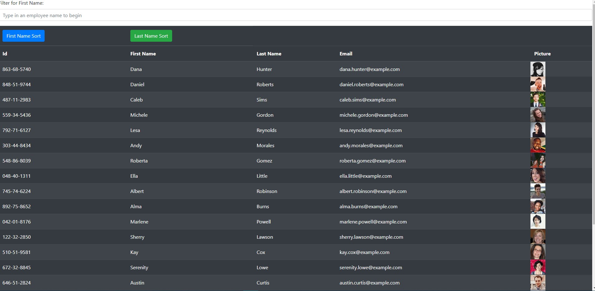
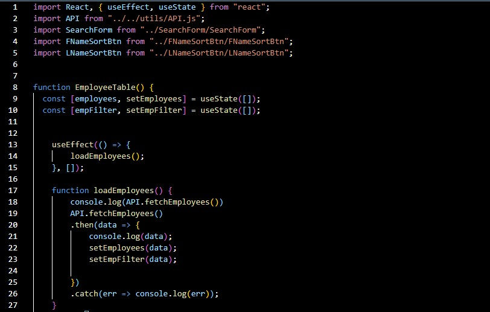

# Employee Directory - React Employee Directory App

## Overview

Employee Directory allows a user to filter and sort their employees on a React generated table.

## Table of Contents

- [Description](#description)
- [Installation](#installation)
- [Usage](#usage)
- [Deployed](#deployed)
- [Tools](#tools)
- [Research](#research)
- [Questions](#questions)
- [License](#license)

## Description

To render a table, Axios, BootStrap and React were utilized to:

- Serve and display randomly generated employees.

To sort and filter the employees the .sort and .filter methods were employed upon button click and inputted name.

## Installation

1. Create a starter React app by running npx create-react-app employeedirectory in the terminal.
2. Use the command-line, npm i, to install Axios and Bootstrap.
3. To start filtering and seraching for employees, use the command, npm run start and navigate in the web browser to localhost:3000.

## Usage

- Axios, React and Bootsrap are used to serve and display to the user
- filtered and searched employees

## Deployed

- \*[Deployed website](https://kay0s.github.io/EmployeeDirectory/)
- \*[GitHub Repository](https://github.com/Kay0s/EmployeeDirectory) 

### Screenshot of Code

## Tools

- React
- CSS
- JavaScript
- Axios
- service-worker.js
- manifest-webmanifest
- Bootstrap

## Research

- [MDN Web Docs - Array.prototype.sort](https://developer.mozilla.org/en-US/docs/Web/JavaScript/Reference/Global_Objects/Array/sort)
- [MDN Web Docs - Array.prototype.filter()](https://developer.mozilla.org/en-US/docs/Web/JavaScript/Reference/Global_Objects/Array/filter)
- [React.js](https://reactjs.org/)

## Questions

- [Email](hamilton.kristina@gmail.com)
- [GitHub Profile](https://github.com/Kay0s)
- [GitHub Repository](https://github.com/Kay0s/EmployeeDirectory)

## License

© 2021 Kristina Hamilton and Trilogy Education Services, a 2U, Inc. brand. All Rights Reserved. Permission is hereby
granted, free of charge, to any person obtaining a copy of this software and associated documentation files (the
"Software"), to deal in the Software without restriction, including without limitation the rights to use, copy, modify,
merge, publish, distribute, sublicense, and/or sell copies of the Software, and to permit persons to whom the Software
is furnished to do so, subject to the following conditions:

The above copyright notice and this permission notice shall be included in all copies or substantial portions of the
Software.

THE SOFTWARE IS PROVIDED "AS IS", WITHOUT WARRANTY OF ANY KIND, EXPRESS OR IMPLIED, INCLUDING BUT NOT LIMITED TO THE
WARRANTIES OF MERCHANTABILITY, FITNESS FOR A PARTICULAR PURPOSE AND NONINFRINGEMENT. IN NO EVENT SHALL THE AUTHORS OR
COPYRIGHT HOLDERS BE LIABLE FOR ANY CLAIM, DAMAGES OR OTHER LIABILITY, WHETHER IN AN ACTION OF CONTRACT, TORT OR
OTHERWISE, ARISING FROM, OUT OF OR IN CONNECTION WITH THE SOFTWARE OR THE USE OR OTHER DEALINGS IN THE SOFTWARE.
